<!-- Specify the report's official name, goal & description. -->
# Row Counts
**Report Description**: This report helps monitor the activity and (partial) health of the databases.

<!-- Point knitr to the underlying code file so it knows where to look for the chunks. -->


<!-- Load the packages.  Suppress the output when loading packages. --> 


<!-- Load any Global Functions declared in the R file.  Suppress the output. --> 


<!-- Declare any global functions specific to a Rmd output.  Suppress the output. --> 


<!-- Load the dataset.   -->


<!-- Tweak the dataset.   -->


```
## This report covers records between 2013-08-30 00:09:00 and 2013-09-02 22:09:14.
```

```
## This report contains information from 1 databases, 27 tables, and 328 records.
```


## Tables
The history of each table is shown in a line graph.  The text above each line is the change since the last measurement.


  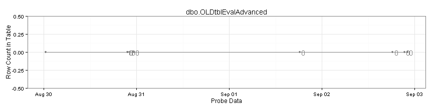 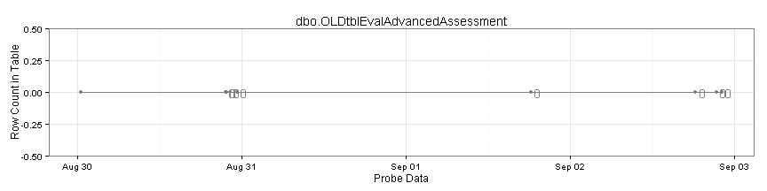  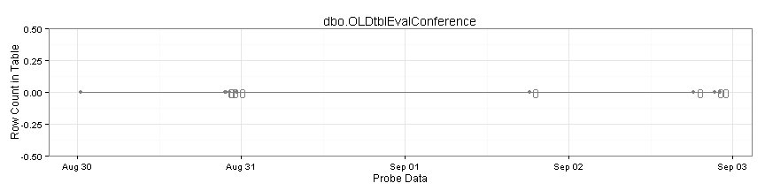     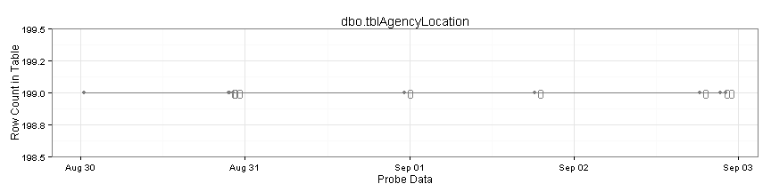   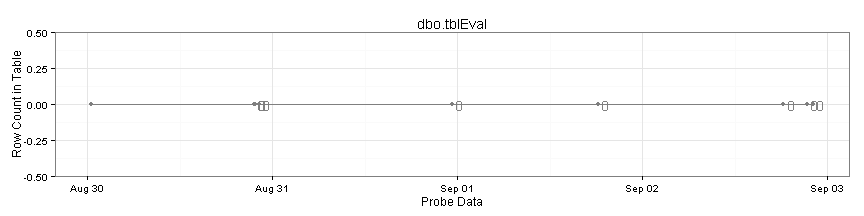 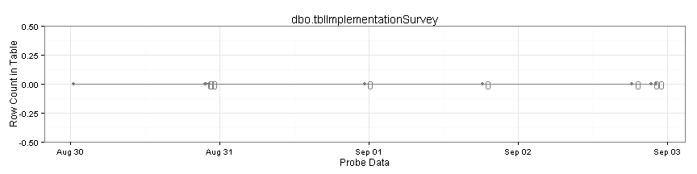  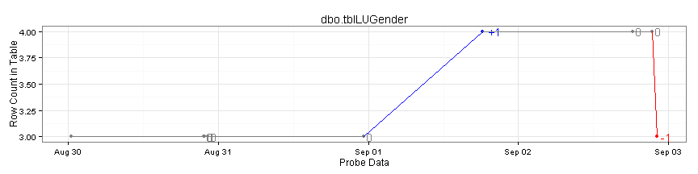 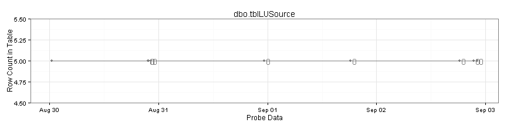 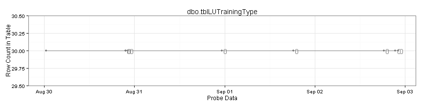     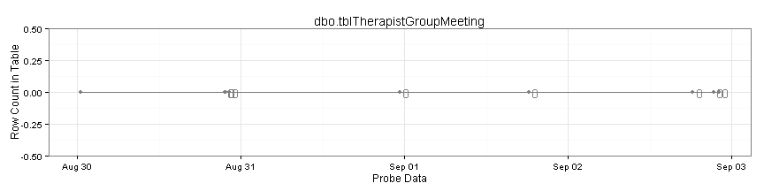 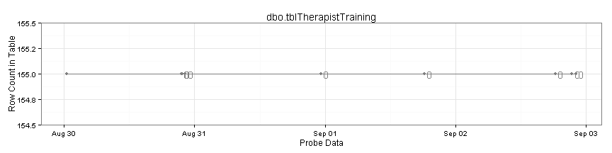  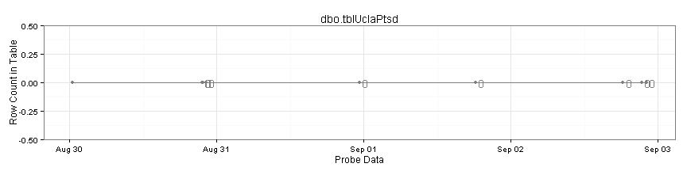 

