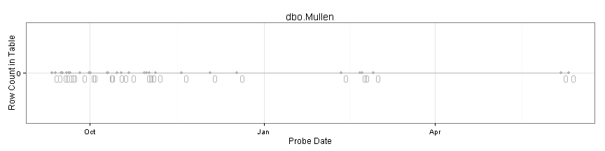
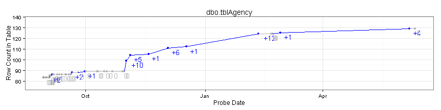

<!-- Specify the report's official name, goal & description. -->
# Row Counts
**Report Description**: This report helps monitor the activity and (partial) health of the databases.

<!-- Point knitr to the underlying code file so it knows where to look for the chunks. -->


<!-- Load the packages.  Suppress the output when loading packages. --> 


<!-- Load any Global Functions declared in the R file.  Suppress the output. --> 


<!-- Declare any global functions specific to a Rmd output.  Suppress the output. --> 


<!-- Load the dataset.   -->


<!-- Tweak the dataset.   -->


```
## This report covers records between 2013-08-30 00:30:28 and 2013-09-04 13:44:18.
## This report contains information from 1 databases, 18 tables, and 324 records.
```


## Row Count of Each Table of Each Database
The table displays the number of records in each table, and how that count has increased or decreased since the last occasion the table was probed.

Below the table are line graphs that show the history of each database table.  The text above each line is the change since the last probe.


```
##    database                        table          probe_date row_count time_gap_in_hours change_pretty
## 1     Tfcbt                dbo.tblAgency 2013-09-04 13:44:18       255             2.067             0
## 2     Tfcbt        dbo.tblAgencyLocation 2013-09-04 13:44:18       202             2.067             0
## 3     Tfcbt             dbo.tblCallGroup 2013-09-04 13:44:18        29             2.067             0
## 4     Tfcbt      dbo.tblCallGroupMeeting 2013-09-04 13:44:18       169             2.067             0
## 5     Tfcbt                  dbo.tblEval 2013-09-04 13:44:18         0             2.067             0
## 6     Tfcbt  dbo.tblImplementationSurvey 2013-09-04 13:44:18         0             2.067             0
## 7     Tfcbt             dbo.tblLUDecided 2013-09-04 13:44:18         3             2.067             0
## 8     Tfcbt              dbo.tblLUGender 2013-09-04 13:44:18         3             2.067             0
## 9     Tfcbt              dbo.tblLUSource 2013-09-04 13:44:18         5             2.067             0
## 10    Tfcbt        dbo.tblLUTrainingType 2013-09-04 13:44:18        30             2.067             0
## 11    Tfcbt             dbo.tblPresenter 2013-09-04 13:44:18        18             2.067             0
## 12    Tfcbt               dbo.tblSession 2013-09-04 13:44:18         8             2.067             0
## 13    Tfcbt             dbo.tblTherapist 2013-09-04 13:44:18       735             2.067           +45
## 14    Tfcbt         dbo.tblTherapistEval 2013-09-04 13:44:18         0             2.067             0
## 15    Tfcbt dbo.tblTherapistGroupMeeting 2013-09-04 13:44:18         0             2.067             0
## 16    Tfcbt     dbo.tblTherapistTraining 2013-09-04 13:44:18       222             2.067            +1
## 17    Tfcbt              dbo.tblTraining 2013-09-04 13:44:18       329             2.067             0
## 18    Tfcbt              dbo.tblUclaPtsd 2013-09-04 13:44:18         0             2.067             0
```


## Tfcbt  database graphs
                  

